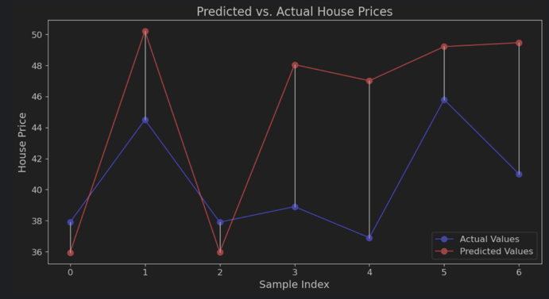
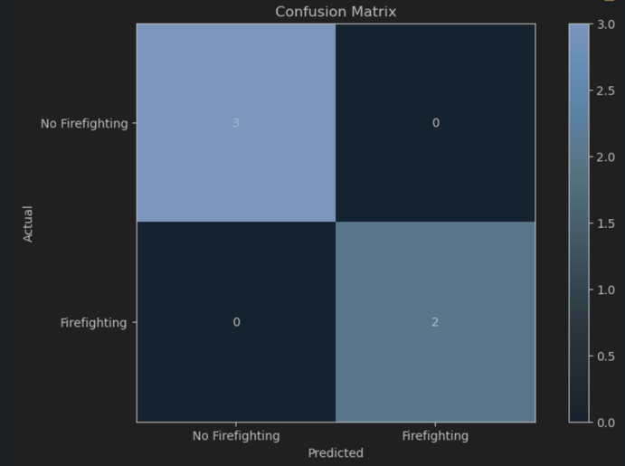

# Linear and Logistic Regression with Gradient Descent Using NumPy

This project includes scripts for performing both linear regression and logistic regression using gradient descent with NumPy. The linear regression script predicts house prices, and the logistic regression script predicts the presence of firefighting facilities based on various features from a dataset.

## Linear Regression

The linear regression script performs the following steps:

1. **Load and preprocess the data**: Load the dataset from a CSV file and split it into features and target variables.
2. **Split the data**: Divide the data into training (75%) and testing (25%) sets.
3. **Train the linear regression model**: Use gradient descent to optimize the weights and bias.
4. **Evaluate the model**: Calculate the Mean Squared Error (MSE) on the test set.
5. **Visualize the results**: Plot the predicted vs. actual house prices and connect the corresponding points.

### Requirements

- Python 3.x
- NumPy
- Matplotlib

### Output

The script will print the Mean Squared Error (MSE) of the predictions and display a plot of the predicted vs. actual house prices.

### Mean Squared Error

The Mean Squared Error (MSE) is a measure of the average squared difference between the predicted and actual values. It is used to evaluate the performance of the regression model.

### Predicted vs. Actual House Prices Plot

The plot below shows the predicted vs. actual house prices. The blue dots represent the actual values, and the red dots represent the predicted values. The black lines connect the corresponding points to visualize the prediction errors.

## Logistic Regression

The logistic regression script performs the following steps:

1. **Load and preprocess the data**: Load the dataset from a CSV file and split it into features and target variables.
2. **Split the data**: Divide the data into training (85%) and testing (15%) sets.
3. **Train the logistic regression model**: Use gradient descent to optimize the weights and bias.
4. **Evaluate the model**: Calculate the accuracy, recall, precision, and F-measure (F1 score) on the test set.
5. **Visualize the results**: Plot the confusion matrix to provide insight into the model's predictions.

### Requirements

- Python 3.x
- NumPy
- Matplotlib

### Output

The script will print the accuracy, recall, precision, and F-measure of the predictions and display a confusion matrix.

### Evaluation Metrics

- **Accuracy**: The ratio of correctly predicted instances to the total instances.
- **Recall**: The ratio of correctly predicted positive observations to the actual positives.
- **Precision**: The ratio of correctly predicted positive observations to the total predicted positives.
- **F-measure (F1 Score)**: The weighted average of precision and recall.

### Confusion Matrix

The confusion matrix below visualizes the performance of the logistic regression model. It shows the number of true positives, true negatives, false positives, and false negatives.

